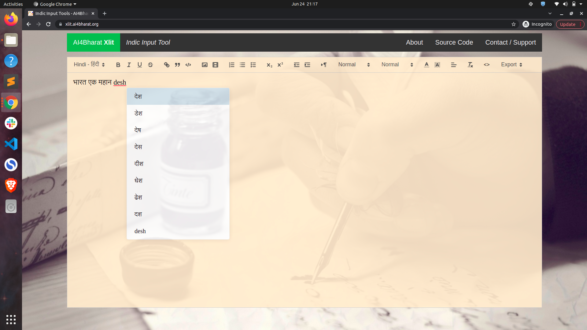

<div align="center">
	<h1><b><i>IndicXlit</i></b></h1>
	<a href="https://ai4bharat.org/indic-xlit">Website</a> |
	<a href="#download-indicxlit-model">Downloads</a> |
	<a href="https://arxiv.org/abs/2205.03018">Paper</a> |
  <a href="https://xlit.ai4bharat.org/">Demo</a> |
  <a href="https://pypi.org/project/ai4bharat-transliteration">Python Library</a> |
  <a href="https://www.npmjs.com/package/@ai4bharat/indic-transliterate">JavaScript Library</a>
  <br><br>
</div>

<!-- description about IndicXlit -->

***[IndicXlit](https://indicnlp.ai4bharat.org/indic-xlit)*** is a transformer-based multilingual transliteration model (~11M) that ***supports 21 Indic languages*** for Roman to native script and native to Roman script conversions. It is trained on ***[Aksharantar](https://indicnlp.ai4bharat.org/aksharantar/)*** dataset which is the ***largest publicly available parallel corpus containing 26 million word pairs spanning 20 Indic languages*** at the time of writing (5 May 2022). It supports the following 21 Indic languages:

<!-- list of languages IndicXlit supports -->
| <!-- -->  	 | <!-- --> 	  | <!-- --> 	   | <!-- -->	     | <!-- -->       | <!-- -->      |
| -------------- | -------------- | -------------- | --------------- | -------------- | ------------- |
| Assamese (asm) | Bengali (ben)  |  Bodo (brx)    | Gujarati (guj)  | Hindi (hin)    | Kannada (kan) |
| Kashmiri (kas) | Konkani (gom)  | Maithili (mai) | Malayalam (mal) | Manipuri (mni) | Marathi (mar) | 
| Nepali (nep)   | Oriya (ori)    | Panjabi (pan)  |  Sanskrit (san) | Sindhi (snd)   | Sinhala (sin) |
|  Tamil (tam)   |  Telugu (tel)  |   Urdu (urd)   | 

### Evaluation Results

IndicXlit is evaluated on [Dakshina benchmark](https://github.com/google-research-datasets/dakshina) and [Aksharantar benchmark](https://indicnlp.ai4bharat.org/aksharantar/). IndicXlit achieves state-of-the-art results on the Dakshina testset and also provides baseline results on the new Aksharantar testset. The Top-1 results are summarized below. For more details, refer our [paper](https://arxiv.org/abs/2205.03018).

#### En-Indic Results
| Languages | asm | ben | brx | guj | hin | kan | kas | kok | mai | mal | mni | mar | nep | ori | pan | san | tam | tel | urd |
| --- | --- | --- | --- | --- | --- | --- | --- | --- | --- | --- | --- | --- | --- | --- | --- | --- | --- | --- | --- |
| Dakshina | - | 55.49 | - | 62.02 | 60.56 | 77.18 | - | - | - | 63.56 | - | 64.85 | - | - | 47.24 | - | 68.10 | 73.38 | 42.12 | 61.45 |
| Aksharantar (native words) | 60.27 | 61.70 | 70.79 | 61.89 | 55.59 | 76.18 | 28.76 | 63.06 | 72.06 | 64.73 | 83.19 | 63.72 | 80.25 | 58.90 | 40.27 | 78.63 | 69.78 | 84.69 | 48.37 |
| Aksharantar (named entities) | 38.62 | 37.12 | 30.32 | 48.89 | 58.87 | 49.92 | 20.23 | 34.36 | 42.82 | 33.93 | 44.12 | 53.57 | 52.67 | 30.63 | 36.08 | 24.06 | 42.12 | 51.82 | 47.77 |

#### Indic-En Results
| Languages | asm | ben | brx | guj | hin | kan | kas | kok | mai | mal | mni | mar | nep | ori | pan | san | tam | tel | urd |
| --- | --- | --- | --- | --- | --- | --- | --- | --- | --- | --- | --- | --- | --- | --- | --- | --- | --- | --- | --- |
| Aksharantar (native words) | 75.55 | 11.76 | 68.58 | 34.35 | 52.30 | 76.25 | 55.94 | 38.96 | 65.04 | 65.55 | 84.64 | 36.15 | 82.38 | 53.65 | 29.05 | 67.4 | 45.08 | 54.55 | 29.95 |
| Aksharantar (named entities) | 37.86 | 52.54 | 35.49 | 50.56 | 59.22 | 60.77 | 12.87 | 35.09 | 38.18 | 45.23 | 34.87 | 56.76 | 54.05 | 47.68 | 48.00 | 42.71 | 35.46 | 57.57 | 23.14 |

<!-- index with hyperlinks (Table of contents) -->
## Table of contents
- [Table of contents](#table-of-contents)
- [Resources](#resources)
  - [Download IndicXlit model](#download-indicxlit-model)
  - [Using hosted APIs](#using-hosted-apis)
  - [Accessing on ULCA](#accessing-on-ulca)
- [Running inference](#running-inference)
  - [Command line interface](#command-line-interface)
  - [Python interface](#python-interface)
- [Training model](#training-model)
  - [Setting up your environment](#setting-up-your-environment)
  - [Details of models and hyperparameters](#details-of-models-and-hyperparameters)
  - [Training procedure and code](#training-procedure-and-code)
  - [WandB plots](#wandb-plots)
  - [Evaluating trained model](#evaluating-trained-model)
  - [Detailed benchmarking results](#detailed-benchmarking-results)
- [Finetuning model on your data](#finetuning-model-on-your-data)
- [Mining details](#mining-details)
- [Directory structure](#directory-structure)
- [Citing](#citing)
  - [License](#license)
  - [Contributors](#contributors)
  - [Contact](#contact)
- [Acknowledgements](#acknowledgements)

## Resources
### Download IndicXlit model
<!-- hyperlinks for downloading the models -->
Roman to Indic model [v1.0](https://github.com/AI4Bharat/IndicXlit/releases/download/v1.0/indicxlit-en-indic-v1.0.zip)

Indic to Roman model [v1.0](https://github.com/AI4Bharat/IndicXlit/releases/download/v1.0/indicxlit-indic-en-v1.0.zip)
<!-- mirror links set up the public drive -->	

### Using hosted APIs
Roman to Indic [Interface](https://xlit.ai4bharat.org/)

Indic to Roman [Interface](https://xlit.ai4bharat.org/converter)
<details><summary> Click to expand </summary>

#### Sample screenshot of sentence transliteration
<br>
<p align="left">

</p>

Select the language from drop-down list given at top left corner:
<br>
<p align="left">

</p>
	
To transliterate into Hindi, select Hindi from the list and enter your sentence in the "text" field:
<br>
<p align="left">

</p>
<br>
</details>
	
### Accessing on ULCA
You can try out our model at ***ULCA*** under [Transliteration Models](https://bhashini.gov.in/ulca/model/explore-models), and the Aksharantar dataset under [Transliteration Benchmark Datasets](https://bhashini.gov.in/ulca/model/benchmark-datasets).


## Running Inference
### Command line interface
<!-- ## Using the model to transliterate the inputs -->
The model is trained on words as inputs. Hence, users need to split sentences into words before running the transliteration model when using our command line interface.

Follow the Colab notebook to setup the environment, download the trained _IndicXlit_ model and transliterate your own text. GPU support is given in command line interface.

<!-- colab integratation on running the model on custom input cli script -->
Command line interface --> [](https://colab.research.google.com/drive/1GFlqA7fpA2LLKJXtbtXSe-DqrAshuB-L?usp=sharing)

### Python interface
<!-- colab integratation on running the model on custom input python script -->
Python interface --> [](https://colab.research.google.com/drive/1P78Tbr6zhe-5LeiKk525N3SGPKn2ofGg?usp=sharing)

The python interface is useful in case you want to reuse the model for multiple transliterations and do not want to reinitialize the model each time.


## Training model
###  Setting up your environment
<details><summary> Click to expand </summary>

```bash
# Clone IndicXlit repository
git clone https://github.com/AI4Bharat/IndicXlit.git

# Install required libraries
pip install indic-nlp-library

# Install Fairseq from source
git clone https://github.com/pytorch/fairseq.git
cd fairseq
pip install --editable ./

```
</details>


## Details of models and hyperparameters
<!-- network and training details and link to the paper -->

- Architecture: IndicXlit uses 6 encoder and decoder layers, input embeddings of size 256 with 4 attention heads and
feedforward dimension of 1024, with a total of 11M parameters.
- Loss: Cross-Entropy loss
- Optimizer: Adam
- Adam-betas: (0.9, 0.98)
- Peak-learning-rate: 0.001
- Learning-rate-scheduler: inverse-sqrt
- Temperature-sampling (T): 1.5
- Warmup-steps: 4000

Please refer to section 6 of our [paper](https://arxiv.org/abs/2205.03018) for more details on training setup.

### Training procedure and code

The high level steps we follow for training are as follows:

- Organize the train/test/valid data in corpus directory such that it has all the files containing parallel data for en-X (English-X) language pairs in the following format:
  - train_x.en for training file of en-X language pair which contains the space separated Roman characters in each line.
  - train_x.x for training file of en-X language pair which contains the space separated Indic language characters in each line.

```bash
# corpus/
# ├── train_bn.bn
# ├── train_bn.en
# ├── train_gu.gu
# ├── train_gu.en
# ├── ....
# ├── valid_bn.bn
# ├── valid_bn.en
# ├── valid_gu.gu
# ├── valid_gu.en
# ├── ....
# ├── test_bn.bn
# ├── test_bn.en
# ├── test_gu.gu
# ├── test_gu.en
# └── ....

```

- Combine the training files (joint training) across all languages.
```bash
# corpus/
# ├── train_combine.cmb
# └── train_combine.en
```

- Create the joint vocabulary using all the combined training data. 
```bash
fairseq-preprocess \
   --trainpref corpus/train_combine \
   --source-lang en --target-lang cmb \
   --workers 256 \
   --destdir corpus-bin
```

- Create the binarized data required for Fairseq for each language separately using joint vocabulary.
```bash
for lang_abr in bn gu hi kn ml mr pa sd si ta te ur
do
   fairseq-preprocess \
   --trainpref corpus/train_$lang_abr --validpref corpus/valid_$lang_abr --testpref corpus/test_$lang_abr \
   --srcdict corpus-bin/dict.en.txt \
   --tgtdict corpus-bin/dict.cmb.txt \
   --source-lang en --target-lang $lang_abr \
   --workers 32 \
   --destdir corpus-bin 
done
```

- Add all language codes to `lang_list.txt` file and save it in the same directory.

- Start training with fairseq-train command. Please refer to [Fairseq documentaion](https://fairseq.readthedocs.io/en/latest/command_line_tools.html) to know more about each of these options.

- Please refer https://github.com/facebookresearch/fairseq/tree/main/examples/multilingual to know more about the 'translation_multi_simple_epoch' task.   

```bash
# training script
fairseq-train corpus-bin \
  --save-dir transformer \
  --arch transformer --layernorm-embedding \
  --task translation_multi_simple_epoch \
  --sampling-method "temperature" \
  --sampling-temperature 1.5 \
  --encoder-langtok "tgt" \
  --lang-dict lang_list.txt \
  --lang-pairs en-bn,en-gu,en-hi,en-kn,en-ml,en-mr,en-pa,en-sd,en-si,en-ta,en-te,en-ur  \
  --decoder-normalize-before --encoder-normalize-before \
  --activation-fn gelu --adam-betas "(0.9, 0.98)"  \
  --batch-size 1024 \
  --decoder-attention-heads 4 --decoder-embed-dim 256 --decoder-ffn-embed-dim 1024 --decoder-layers 6 \
  --dropout 0.5 \
  --encoder-attention-heads 4 --encoder-embed-dim 256 --encoder-ffn-embed-dim 1024 --encoder-layers 6 \
  --lr 0.001 --lr-scheduler inverse_sqrt \
  --max-epoch 51 \
  --optimizer adam  \
  --num-workers 32 \
  --warmup-init-lr 0 --warmup-updates 4000
```
The above steps are further documented in our Colab notebook --> [](https://colab.research.google.com/drive/1KM8M2hk6fPAI039bBLtHxxojHzo6oMQ7?usp=sharing)

Please refer to section 6 of our [paper](https://arxiv.org/abs/2205.03018) for more details of our training hyperparameters.

### WandB plots
[IndicXlit en-indic model](https://wandb.ai/cs20s002/transliteration_model/runs/3gdvqx6e?workspace=user-cs20s002).

### Evaluating a trained model
- The trained model is saved in the transformer directory. It will have the following files:
```bash
# transformer/
# └── checkpoint_best.pt
```

- To generate outputs after training, use the following generation script to predict outputs which will be saved in the output directory.
```bash
for lang_abr in bn gu hi kn ml mr pa sd si ta te ur
do
source_lang=en
target_lang=$lang_abr
fairseq-generate corpus-bin \
  --path transformer/checkpoint_best.pt \
  --task translation_multi_simple_epoch \
  --gen-subset test \
  --beam 4 \
  --nbest 4 \
  --source-lang $source_lang \
  --target-lang $target_lang \
  --batch-size 2048 \
  --encoder-langtok "tgt" \
  --lang-dict lang_list.txt \
  --num-workers 64 \
  --lang-pairs en-bn,en-gu,en-hi,en-kn,en-ml,en-mr,en-pa,en-sd,en-si,en-ta,en-te,en-ur  > output/${source_lang}_${target_lang}.txt
done
```

- To test the models post training, use `generate_result_files.py` to convert the Fairseq output file into XML files and `evaluate_result_with_rescore_option.py` to compute accuracies.

- `evaluate_result_with_rescore_option.py` can be downloaded using the following link:
```bash
wget https://github.com/AI4Bharat/IndicXlit/releases/download/v1.0/evaluate_result_with_rescore_option.py
```

The above evaluation steps and code for `generate_result_files.py` are further documented in the Colab notebook --> [](https://colab.research.google.com/drive/1KM8M2hk6fPAI039bBLtHxxojHzo6oMQ7?usp=sharing)

### Detailed evaluation results
Refer to [Evaluation Results](#evaluation-results) for results of IndicXlit model on Dakshina and Aksharantar benchmarks.
Please refer to section 7 of our [paper](https://arxiv.org/abs/2205.03018) for a detailed discussion of the results.


<!-- Finetuning the model on cutom dataset and integrate the notebook -->

## Finetuning the model on your input dataset

The high level steps for finetuning on your own dataset are:

- Organize the train/test/valid data in corpus directory such that it has all the files containing parallel data for en-X language pair in the following format:

  - train_x.en for training file of en-X language pair which contains the space separated Roman characters in each line.

  - train_x.x for training file of en-X language pair which contains the space separated Indic characters in each line.

```bash
# corpus/
# ├── train_bn.bn
# ├── train_bn.en
# ├── train_gu.gu
# ├── train_gu.en
# ├── ....
# ├── valid_bn.bn
# ├── valid_bn.en
# ├── valid_gu.gu
# ├── valid_gu.en
# ├── ....
# ├── test_bn.bn
# ├── test_bn.en
# ├── test_gu.gu
# ├── test_gu.en
# └── ....

```

- To download and decompress the model file and joint vocabulary files use the following command.

```bash
# download the IndicXlit models
wget https://github.com/AI4Bharat/IndicXlit/releases/download/v1.0/indicxlit-en-indic-v1.0.zip
unzip indicxlit-en-indic-v1.0.zip
```

- Binarizing the files using the joint dictionaries.

```bash
for lang_abr in bn gu hi kn ml mr pa sd si ta te ur
do
   fairseq-preprocess \
   --trainpref corpus/train_$lang_abr --validpref corpus/valid_$lang_abr --testpref corpus/test_$lang_abr \
   --srcdict corpus-bin/dict.en.txt \
   --tgtdict corpus-bin/dict.mlt.txt \
   --source-lang en --target-lang $lang_abr \
   --destdir corpus-bin 
done
```

- Add all language codes that models supports to `lang_list.txt` file and save it in the same directory.

- Please refer to [Fairseq documentation](https://fairseq.readthedocs.io/en/latest/command_line_tools.html) to know more about each of these options.

```bash
# We will use fairseq-train to finetune the model
# Some notable args:
# --lr                  -> Learning Rate. From our limited experiments, we find that lower learning rates like 3e-5 works best for finetuning.
# --restore-file        -> Reload the pretrained checkpoint and start training from here (change this path for Indic-en; currently it is set to en-Indic).
# --reset-*             -> Reset and not use lr scheduler, dataloader, optimizer etc of the older checkpoint.

fairseq-train corpus-bin \
    --save-dir transformer \
    --arch transformer --layernorm-embedding \
    --task translation_multi_simple_epoch \
    --sampling-method "temperature" \
    --sampling-temperature 1.5 \
    --encoder-langtok "tgt" \
    --lang-dict lang_list.txt \
    --lang-pairs en-bn,en-gu,en-hi,en-kn,en-ml,en-mr,en-pa,en-sd,en-si,en-ta,en-te,en-ur \
    --decoder-normalize-before --encoder-normalize-before \
    --activation-fn gelu --adam-betas "(0.9, 0.98)"  \
    --batch-size 1024 \
    --decoder-attention-heads 4 --decoder-embed-dim 256 --decoder-ffn-embed-dim 1024 --decoder-layers 6 \
    --dropout 0.5 \
    --encoder-attention-heads 4 --encoder-embed-dim 256 --encoder-ffn-embed-dim 1024 --encoder-layers 6 \
    --lr 0.001 --lr-scheduler inverse_sqrt \
    --max-epoch 51 \
    --optimizer adam  \
    --num-workers 32 \
    --warmup-init-lr 0 --warmup-updates 4000 \
    --keep-last-epochs 5 \
    --patience 5 \
    --restore-file transformer/indicxlit.pt \
    --reset-lr-scheduler \
    --reset-meters \
    --reset-dataloader \
    --reset-optimizer
```

The above steps (setting up the environment, downloading the trained _IndicXlit_ model and preparing your custom dataset for finetuning) are further documented in our Colab notebook --> [](https://colab.research.google.com/drive/1TurBNE0Pq9_hqEOXps0FXfymsdlJotE0?usp=sharing)


## Mining details
Following links provide a detailed description of mining from various resources:
- Samanantar: https://github.com/AI4Bharat/IndicXlit/tree/master/data_mining/transliteration_mining_samanantar
- IndicCorp: https://github.com/AI4Bharat/IndicXlit/tree/master/data_mining/IndicCorp/skeleton/en_dict_workplace

## Directory structure
<!-- directory structure for the repo -->
```
IndicXlit
├── Checker
│   ├── README.md
│   ├── Transliteration_Checker.java
│   └── Transliteration_Checker.py
├── Dataset_Format
│   ├── Create_Aksharantar_JSONL.py
│   └── README.md
├── LICENSE
├── README.md
├── ULCA_Format
│   ├── README.md
│   └── ULCA_dataset.py
├── ablation_study
│   ├── data_filteration
│   │   ├── data_filteration_with_benchmark_test_dakshina_test_valid
│   │   └── data_filteration_with_dakshina_test_valid
│   └── model
│       ├── monolingual_model
│       ├── multilingual_model_(same for_singlescript_model)
│       ├── north_model
│       ├── preprocessing_for_rescoring
│       ├── south_model
│       └── specific_to_E_because_(differ_across_dataset_E_has_specific_langs)
├── app
│   ├── Caddyfile
│   ├── Hosting.md
│   ├── MANIFEST.in
│   ├── README.md
│   ├── ai4bharat
│   │   ├── __init__.py
│   │   └── transliteration
│   ├── api_expose.py
│   ├── auto_certif_renew.py
│   ├── dependencies.txt
│   ├── setup.py
│   └── start_server.py
├── corpus_preprocessing
│   ├── Analysis
│   │   ├── GIT_analysis.py
│   │   ├── README.md
│   │   └── len_stats.py
│   ├── Benchmark_data_from_JSONS(Karya)
│   │   ├── Benchmark_Named_entities.py
│   │   ├── Benchmark_Transliteration_data.py
│   │   └── README.md
│   ├── Collating_existing_dataset
│   │   ├── collate_data.ipynb
│   │   ├── dataset_info.csv
│   │   └── stats_detail.txt
│   ├── Create_Unique_list_from_datasets
│   │   ├── IndicCorp
│   │   ├── LDCIL
│   │   ├── README.md
│   │   └── Words_freq_probability_after_kenlm
│   └── Pre_process_arabic_scripts
│       ├── README.md
│       └── clean_urdu.py
├── data_mining
│   ├── IndicCorp
│   │   ├── preprocess_data
│   │   └── skeleton
│   ├── readme.md
│   └── transliteration_mining_samanantar
│       ├── align_data.sh
│       ├── convert_csv.py
│       ├── extract_translit_pairs.sh
│       ├── install_tools.txt
│       ├── model_run_steps.txt
│       ├── preprocess_data.py
│       ├── readme.md
│       ├── samanantar_pairs_count.xlsx
│       └── validation_script.py
├── inference
│   ├── cli
│   │   ├── en-indic
│   │   │	├── generate_result_files.py
│   │ 	│	├── interactive.sh
│   │   │	├── lang_list.txt
│   │   │	└── transliterate_word.sh
│   │   └── indic-en
│   │   	├── generate_result_files.py
│   │ 		├── interactive.sh
│   │   	├── lang_list.txt
│   │   	└── transliterate_word.sh
│   └── python
│       ├── custom_interactive.py
│       ├── lang_list.txt
│       ├── test_api_inference.py
│       └── xlit_translit.py
├── model_training_scripts
│   ├── README.md
│   ├── binarizing
│   │   └── preprocess_all_lang.sh
│   ├── data_filtration
│   │   ├── combining_data_acrooss_lang.py
│   │   ├── refresh_data_train_all_test_valid.py
│   │   └── refresh_test_valid_data.py
│   ├── evaluate
│   │   ├── evaluate_result_with_rescore_option.py
│   │   ├── final_result.sh
│   │   └── final_result_without_rescoring.sh
│   ├── generation
│   │   ├── generate.sh
│   │   └── generate_result_files.py
│   ├── skeleton
│   │   ├── blank_file.txt
│   │   ├── creating_dir_struct.sh
│   │   ├── indiccorp
│   │   ├── mined_data
│   │   ├── multi_lang
│   │   ├── preprocess_data
│   │   └── working
│   ├── training
│   │   ├── lang_list.txt
│   │   └── train.sh
│   └── vocab_creation
│       └── preprocess.sh
└── sample_images
    ├── main_page.png
    ├── select_language.png
    └── transliterate_sentence.png
```

<!-- citing information -->
## Citing

If you are using any of the resources, please cite the following article:

```
@article{Madhani2022AksharantarTB,
  title={Aksharantar: Towards building open transliteration tools for the next billion users},
  author={Yash Madhani and Sushane Parthan and Priyanka A. Bedekar and Ruchi Khapra and Vivek Seshadri and Anoop Kunchukuttan and Pratyush Kumar and Mitesh M. Khapra},
  journal={ArXiv},
  year={2022},
  volume={abs/2205.03018}
}
```

We would like to hear from you if:
- You are using our resources. Please let us know how you are putting these resources to use.
- You have any feedback on these resources.

<!-- License -->
### License

The IndicXlit code (and models) are released under the MIT License.

<!-- Contributors -->
### Contributors
 - Yash Madhani <sub> ([AI4Bharat](https://ai4bharat.org), [IITM](https://www.iitm.ac.in)) </sub>
 - Sushane Parthan <sub> ([AI4Bharat](https://ai4bharat.org), [IITM](https://www.iitm.ac.in)) </sub>
 - Priyanka Bedakar <sub> ([AI4Bharat](https://ai4bharat.org), [IITM](https://www.iitm.ac.in)) </sub>
 - Ruchi Khapra <sub> ([AI4Bharat](https://ai4bharat.org)) </sub>
 - Gokul NC <sub> ([AI4Bharat](https://ai4bharat.org)) </sub>
 - Anoop Kunchukuttan <sub> ([AI4Bharat](https://ai4bharat.org), [Microsoft](https://www.microsoft.com/en-in/)) </sub>
 - Pratyush Kumar <sub> ([AI4Bharat](https://ai4bharat.org), [Microsoft](https://www.microsoft.com/en-in/), [IITM](https://www.iitm.ac.in)) </sub>
 - Mitesh M. Khapra <sub> ([AI4Bharat](https://ai4bharat.org), [IITM](https://www.iitm.ac.in)) </sub>

<!-- Contact -->
### Contact
- Anoop Kunchukuttan ([anoop.kunchukuttan@gmail.com](mailto:anoop.kunchukuttan@gmail.com))
- Mitesh Khapra ([miteshk@cse.iitm.ac.in](mailto:miteshk@cse.iitm.ac.in))
- Pratyush Kumar ([pratyush@cse.iitm.ac.in](mailto:pratyush@cse.iitm.ac.in))

## Acknowledgements

We would like to thank EkStep Foundation for their generous grant which helped in setting up the Centre for AI4Bharat at IIT Madras to support our students, research staff, data and computational requirements. We would like to thank The Ministry of Electronics and Information Technology (NLTM) for its grant to support the creation of datasets and models for Indian languages under its ambitious Bhashini project. We would also like to thank the Centre for Development of Advanced Computing, India (C-DAC) for providing access to the Param Siddhi supercomputer for training our models. Lastly, we would like to thank Microsoft for its grant to create datasets, tools and resources for Indian languages.
